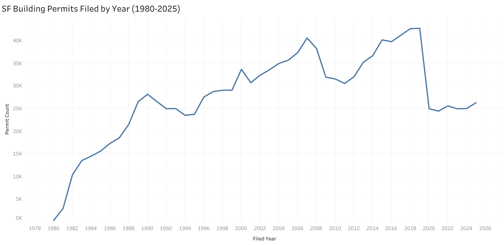
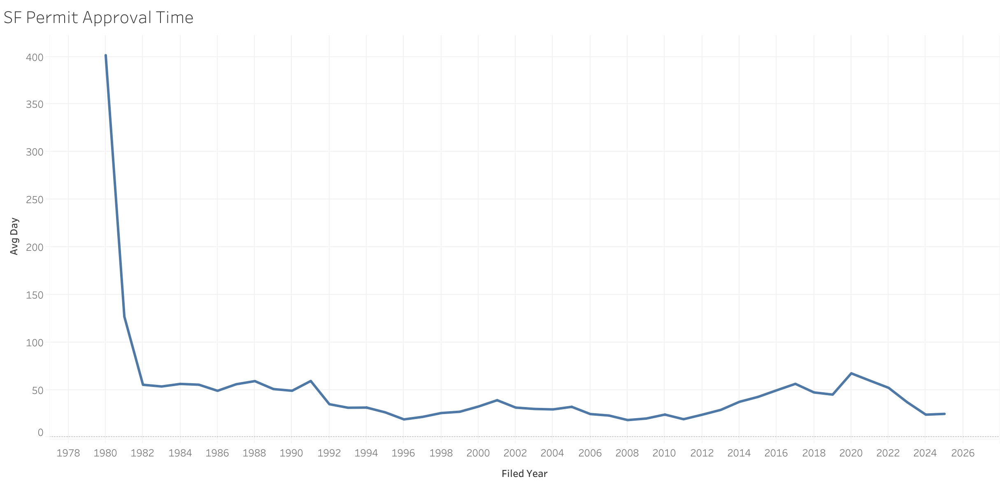

# SF Building Permits Analysis

## Overview
This project analyzes San Francisco's public building permits dataset using SQL to explore how permit activity and approval speed have changed over time, and where the biggest bottlenecks are.

## Project Question
How has San Francisco's building permit activity and approval speed changed over time, and where are the biggest bottlenecks?

This breaks down into a few sub-questions:
- How has permit volume changed year over year?
- How long does it take permits to go from filed to issued, and has that changed over time?
- Which permit types or neighborhoods have the slowest approval times?
- Has the mix of residential vs. commercial permits shifted?

## Data Source
[SF Building Permits](https://data.sf.gov/Housing-and-Buildings/Building-Permits/i98e-djp9) — San Francisco's Open Data Portal (DataSF)

## Data Quality Notes
While exploring the dataset, a few real-world data quality issues were identified and documented:

- **Date fields imported as text**: The "Filed Date," "Issued Date," and "Completed Date" columns were originally stored as text rather than proper date/timestamp values. New cleaned columns (`filed_date_clean`, `issued_date_clean`, `completed_date_clean`) were created to enable accurate date calculations.
- **Illogical date ordering in older records**: Approximately 1% of rows (2,292 out of ~200k) have an Issued Date earlier than the Filed Date. This issue is concentrated in older records (1980s-90s), likely reflecting inconsistencies from historical data entry or digitization. These rows are excluded from approval-time calculations to avoid skewing results.
- **Blank vs. null values**: Empty date fields were sometimes stored as empty strings rather than true NULL values, requiring explicit checks for both.
- **Excluded data**: Intentionally excluded sparse and inconsistent pre-1980 data as well as incomplete 2026 data in analysis.

## Findings

### 1. Permit Volume Over Time
Permit filings grew steadily from 1980 (259 permits) through a peak in 2019 (42,681 permits), reflecting several decades of increasing development activity in San Francisco. Filings dropped sharply in 2020 (24,925, a ~42% decline from 2019), likely reflecting COVID-19 disruptions to construction and permitting processes. Volume has remained in a lower, relatively stable range (~24,000-26,000/year) from 2020-2025, well below pre-pandemic levels.

*Note: Analysis excludes pre-1980 records (sparse and likely incomplete/unreliable) and 2026 (partial year, data as of September 10, 2026).*

🔗 [View interactive version on Tableau Public](https://public.tableau.com/app/profile/leena.qureshi/viz/SFBuildingPermits_17894082363590/SFPermitVolumebyYear#1)

### 2. Permit Approval Time Over Time
Average approval time (days from filed to issued) has changed a lot over the years, from around 18 days in 2008 to 67 days in 2020. Excluding 1980 (explained below), approval times were around 50-60 days through the late 1980s, dropped to their lowest point in the late 2000s and early 2010s, then went back up starting around 2013, peaking in 2020. It's worth noting that 2020's peak happened even though permit volume dropped that year (see Finding 1), so it wasn't simply a matter of more permits taking longer to process. Approval times have gone back down since, landing around 24-25 days in 2024-2025.

*Note: Rows where the issued date came before the filed date (about 1% of records, mostly older data, see Data Quality Notes) were excluded. 1980's average (401 days) is unusually high, likely because only 259 permits were filed that year compared to 2,000+ in nearby years, so a few slow permits skewed the average.*

🔗 [View interactive version on Tableau Public](https://public.tableau.com/app/profile/leena.qureshi/viz/SFBuildingPermitApprovalTime1980-2025/SFPermitApprovalTime#1)

### 3. Approval Time by Permit Type and Neighborhood

**By permit type:** New construction and demolition permits take the longest to get approved, averaging 300-490 days. Additions, alterations, and repairs average about 116 days. Simpler permit types like signs, wall paintings, and OTC (over the counter) alterations move much faster, averaging under 45 days.

**By neighborhood:** Treasure Island (113 days) and Bayview Hunters Point (82 days) have the slowest average approval times. Lincoln Park (17 days), Sunset/Parkside (27 days), and West of Twin Peaks (27 days) are among the fastest. Most neighborhoods fall somewhere between 30-45 days.

*Note: One row had a blank neighborhood value (401 permits) and was excluded from this comparison.*

🔗 [View interactive version on Tableau Public](https://public.tableau.com/app/profile/leena.qureshi/viz/SFBuildingPermitApprovalTimebyZipcode1980-2025/SFPermitApprovalTimebyZipcode#1)

## Tools
SQL (PostgreSQL), TablePlus, Tableau
